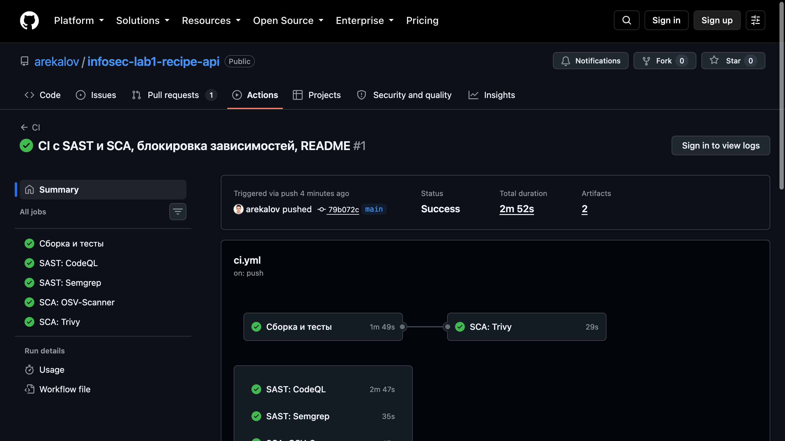
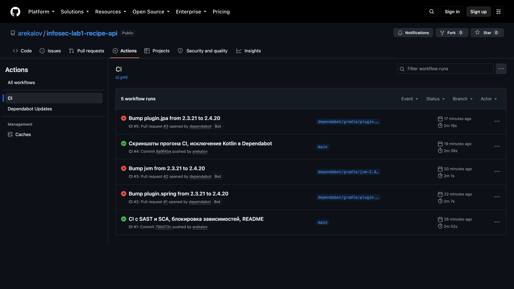

# Recipe API — защищённый REST API на Kotlin + Spring Boot

Лабораторная работа №1 по дисциплине «Информационная безопасность», ИТМО.

REST API для хранения кулинарных рецептов. Каждый пользователь работает только со своими
рецептами; доступ к данным возможен исключительно по JWT-токену, выданному после входа.

Проект написан так, чтобы каждая мера защиты была не декларацией, а проверяемым фактом:
на каждую из них есть автотест, а на большинство — ещё и сценарий в `scripts/smoke.sh`.

| | |
|---|---|
| Язык | Kotlin 2.3.21 |
| Фреймворк | Spring Boot 4.1.1, Spring Security 7.1.1 |
| JVM | Java 21 (toolchain) |
| Хранилище | H2 в файловом режиме, доступ через Spring Data JPA |
| Токены | JWT HS256, Nimbus (`spring-security-oauth2-jose`) |
| Хэш паролей | bcrypt, cost 12 |
| Сборка | Gradle 9.7.1 (wrapper) |

---

## Содержание

- [Быстрый старт](#быстрый-старт)
- [API](#api)
- [Меры защиты](#меры-защиты)
- [CI/CD и отчёты сканеров](#cicd-и-отчёты-сканеров)
- [Тестирование](#тестирование)
- [Что осознанно не сделано](#что-осознанно-не-сделано)

---

## Быстрый старт

Нужен только JDK (Gradle приедет через wrapper).

```bash
git clone https://github.com/arekalov/infosec-lab1-recipe-api.git
cd infosec-lab1-recipe-api

# Ключ подписи токенов. В репозитории его нет и быть не должно.
cp .env.example .env
echo "JWT_SECRET=$(openssl rand -base64 32)" >> .env

./scripts/run.sh
```

Приложение поднимется на `http://localhost:8080`.

Без `JWT_SECRET` запуск прерывается с понятной ошибкой — это сделано намеренно: молчаливый
старт со значением по умолчанию означал бы, что все токены в мире подписаны одним общим
ключом, который лежит в открытом репозитории.

Полная сквозная проверка (31 сценарий, включая негативные):

```bash
./scripts/smoke.sh
```

---

## API

Публичны только `/auth/register` и `/auth/login`. Все остальные маршруты требуют заголовок
`Authorization: Bearer <token>`.

| Метод | Путь | Доступ | Назначение |
|---|---|---|---|
| `POST` | `/auth/register` | открыт | Регистрация |
| `POST` | `/auth/login` | открыт | Вход, выдача JWT |
| `GET` | `/api/data` | JWT | Список своих рецептов, поиск и пагинация |
| `POST` | `/api/recipes` | JWT | Создать рецепт |
| `GET` | `/api/recipes/{id}` | JWT + владелец | Прочитать рецепт |
| `PUT` | `/api/recipes/{id}` | JWT + владелец | Обновить рецепт |
| `DELETE` | `/api/recipes/{id}` | JWT + владелец | Удалить рецепт |

Ошибки возвращаются в формате [RFC 7807](https://datatracker.ietf.org/doc/html/rfc7807)
(`application/problem+json`).

### `POST /auth/register`

Логин: 3–32 символа из `a-z A-Z 0-9 . _ -`. Пароль: не короче 12 символов.

```bash
curl -X POST http://localhost:8080/auth/register \
  -H 'Content-Type: application/json' \
  -d '{"username":"alice","password":"correct-horse-battery-staple"}'
```

```json
{
  "id": 1,
  "username": "alice",
  "roles": ["USER"],
  "createdAt": "2026-09-19T10:06:13.562190Z"
}
```

`409 Conflict` — логин занят. `400 Bad Request` — нарушены требования к логину или паролю.

### `POST /auth/login`

```bash
curl -X POST http://localhost:8080/auth/login \
  -H 'Content-Type: application/json' \
  -d '{"username":"alice","password":"correct-horse-battery-staple"}'
```

```json
{
  "accessToken": "eyJhbGciOiJIUzI1NiJ9...",
  "tokenType": "Bearer",
  "expiresIn": 900
}
```

`401 Unauthorized` — неверные учётные данные. `429 Too Many Requests` — превышен лимит попыток.

### `GET /api/data`

Параметры: `q` — подстрока в названии, `page` (с нуля), `size` (по умолчанию 20, максимум 100).

```bash
TOKEN=$(curl -s -X POST http://localhost:8080/auth/login \
  -H 'Content-Type: application/json' \
  -d '{"username":"alice","password":"correct-horse-battery-staple"}' \
  | python3 -c 'import sys,json;print(json.load(sys.stdin)["accessToken"])')

curl -H "Authorization: Bearer $TOKEN" 'http://localhost:8080/api/data?q=борщ&page=0&size=20'
```

```json
{
  "items": [
    {
      "id": 1,
      "title": "Борщ",
      "description": "Классический борщ",
      "ingredients": ["свёкла", "капуста", "говядина"],
      "instructions": "Сварить бульон, добавить овощи, тушить 40 минут.",
      "cookMinutes": 120,
      "servings": 6,
      "createdAt": "2026-09-19T10:06:13.562190Z",
      "updatedAt": "2026-09-19T10:06:13.562190Z"
    }
  ],
  "page": 0,
  "size": 20,
  "totalItems": 1,
  "totalPages": 1
}
```

### `POST /api/recipes`

```bash
curl -X POST http://localhost:8080/api/recipes \
  -H "Authorization: Bearer $TOKEN" \
  -H 'Content-Type: application/json' \
  -d '{
    "title": "Борщ",
    "description": "Классический борщ",
    "ingredients": ["свёкла", "капуста", "говядина"],
    "instructions": "Сварить бульон, добавить овощи, тушить 40 минут.",
    "cookMinutes": 120,
    "servings": 6
  }'
```

`201 Created` с телом рецепта и заголовком `Location`.

Ограничения: `title` 3–120 символов, `description` до 2000, `ingredients` 1–50 элементов
по 200 символов, `instructions` до 5000, `cookMinutes` 1–1440, `servings` 1–100.
При нарушении — `400` с разбором по полям:

```json
{
  "status": 400,
  "title": "Bad Request",
  "detail": "Request validation failed",
  "errors": {
    "title": ["size must be between 3 and 120"],
    "ingredients": ["must not be empty"]
  }
}
```

### `GET`, `PUT`, `DELETE /api/recipes/{id}`

```bash
curl -H "Authorization: Bearer $TOKEN" http://localhost:8080/api/recipes/1
curl -X PUT http://localhost:8080/api/recipes/1 -H "Authorization: Bearer $TOKEN" \
  -H 'Content-Type: application/json' -d '{ ... то же тело, что при создании ... }'
curl -X DELETE http://localhost:8080/api/recipes/1 -H "Authorization: Bearer $TOKEN"
```

`DELETE` возвращает `204 No Content`. Обращение к чужому рецепту возвращает `404`, а не `403` —
почему именно так, описано ниже.

---

## Меры защиты

### 1. SQL-инъекции (OWASP A03: Injection)

**Что сделано.** В проекте нет ни одной строки, где пользовательский ввод склеивается с текстом
SQL-запроса. Весь доступ к БД идёт через Spring Data JPA: либо derived-методы, которые Spring
строит из имени метода, либо JPQL с именованными параметрами.

[`RecipeRepository.kt`](src/main/kotlin/ru/itmo/infosec/recipes/repository/RecipeRepository.kt):

```kotlin
@Query(
    """
    SELECT r FROM Recipe r
    WHERE r.owner.username = :username
      AND LOWER(r.title) LIKE LOWER(CONCAT('%', :query, '%'))
    """,
)
fun search(
    @Param("username") username: String,
    @Param("query") query: String,
    pageable: Pageable,
): Page<Recipe>
```

**Почему это работает.** `:query` — не подстановка в текст, а bind-переменная. Hibernate
отправляет в БД запрос с плейсхолдером `?`, а значение передаёт отдельно, уже после того как
СУБД разобрала структуру запроса. Изменить эту структуру данными невозможно в принципе:
`' OR '1'='1` попадает внутрь `LIKE` как обычная строка и сравнивается с названием рецепта.

Уязвимый вариант выглядел бы так — и его в проекте нет:

```kotlin
// ТАК НЕ СДЕЛАНО: структура запроса зависит от данных пользователя
entityManager.createQuery("SELECT r FROM Recipe r WHERE r.title LIKE '%$query%'")
```

**Как проверить.**

```bash
curl -G -H "Authorization: Bearer $TOKEN" http://localhost:8080/api/data \
  --data-urlencode "q=' OR '1'='1"
# {"items":[],"page":0,"size":20,"totalItems":0,"totalPages":0}

curl -G -H "Authorization: Bearer $TOKEN" http://localhost:8080/api/data \
  --data-urlencode "q='; DROP TABLE recipes;--"
# 200, таблица на месте
```

Тест: `payload SQL-инъекции обрабатывается как обычный текст` в
[`RecipeApiTests.kt`](src/test/kotlin/ru/itmo/infosec/recipes/RecipeApiTests.kt).

### 2. XSS (OWASP A03)

**Что сделано.** Защита двухслойная.

*На входе* — Jakarta Validation в DTO ([`RecipeDtos.kt`](src/main/kotlin/ru/itmo/infosec/recipes/web/dto/RecipeDtos.kt),
[`AuthDtos.kt`](src/main/kotlin/ru/itmo/infosec/recipes/web/dto/AuthDtos.kt)). Логин вдобавок
ограничен безопасным алфавитом `^[a-zA-Z0-9_.-]+$`, поэтому разметка в нём невозможна.

*На выходе* — экранирование через OWASP Java Encoder в единственной точке, где сущность
превращается в ответ ([`RecipeMapper.kt`](src/main/kotlin/ru/itmo/infosec/recipes/web/RecipeMapper.kt)):

```kotlin
fun Recipe.toResponse(): RecipeResponse = RecipeResponse(
    title = Encode.forHtml(title),
    description = Encode.forHtml(description),
    ingredients = ingredients.map(Encode::forHtml),
    instructions = Encode.forHtml(instructions),
    ...
)
```

**Почему именно на выходе, а не при сохранении.** Экранирование зависит от контекста, в котором
данные окажутся. Если «чистить» текст при записи, исходное значение теряется безвозвратно, а
контекст на тот момент ещё неизвестен. Экранирование на границе выдачи сохраняет данные целыми
и применяет ровно то преобразование, которое нужно потребителю.

**Почему в одной точке.** Если бы экранирование жило в контроллерах, любой новый эндпоинт мог бы
его не вызвать. Маппер — единственный путь от сущности к ответу, и обойти его нельзя.

**Дополнительно** — заголовки, выставленные в [`SecurityConfig.kt`](src/main/kotlin/ru/itmo/infosec/recipes/config/SecurityConfig.kt):
`X-Content-Type-Options: nosniff` (браузер не станет угадывать тип и исполнять JSON как скрипт),
`X-Frame-Options: DENY`, `Content-Security-Policy: default-src 'none'; frame-ancestors 'none'`,
`Referrer-Policy: no-referrer`.

**Как проверить.**

```bash
curl -X POST http://localhost:8080/api/recipes -H "Authorization: Bearer $TOKEN" \
  -H 'Content-Type: application/json' \
  -d '{"title":"<script>alert(1)</script>","description":"",
       "ingredients":["<b>x</b>"],"instructions":"Готовить.","cookMinutes":10,"servings":1}'
```

```json
{
  "title": "&lt;script&gt;alert(1)&lt;/script&gt;",
  "description": "&lt;img src=x onerror=alert(1)&gt;"
}
```

Подстрока `onerror=alert(1)` в значении остаётся — и это правильно. Безопасность обеспечивает не
удаление слов, а экранирование угловых скобок: без них браузер никогда не разберёт текст как
HTML-элемент с обработчиком события.

### 3. Аутентификация (OWASP A07: Identification and Authentication Failures)

#### Хранение паролей

[`SecurityConfig.kt`](src/main/kotlin/ru/itmo/infosec/recipes/config/SecurityConfig.kt):

```kotlin
@Bean
fun passwordEncoder(): PasswordEncoder = BCryptPasswordEncoder(12)
```

В БД попадает только строка вида `$2a$12$...`. Соль bcrypt генерирует сам и хранит внутри хэша,
поэтому одинаковые пароли разных пользователей дают разные хэши, и одна радужная таблица не
вскрывает всю базу.

Cost-фактор 12 означает 2¹² итераций — около 200–300 мс на проверку. Для входа это незаметно,
а для перебора это разница между «миллиарды паролей в секунду» и «десятки». Именно этим bcrypt
отличается от SHA-256: SHA-256 спроектирован быть быстрым, что для хэширования паролей — изъян.

Проверяется тестом `регистрация не возвращает и не хранит пароль в открытом виде`: он читает
запись напрямую из репозитория и убеждается, что там bcrypt-хэш нужного формата.

#### Выдача токена

[`TokenService.kt`](src/main/kotlin/ru/itmo/infosec/recipes/service/TokenService.kt) выпускает
JWT HS256 на 15 минут с claims `iss`, `sub`, `iat`, `exp`, `roles`. Ничего чувствительного в
токен не кладётся: JWT подписывается, но не шифруется, и его содержимое читает любой владелец.

Ключ приходит из переменной окружения `JWT_SECRET` и проверяется на старте
([`JwtProperties.kt`](src/main/kotlin/ru/itmo/infosec/recipes/config/JwtProperties.kt)): если
после Base64-декодирования получилось меньше 32 байт, приложение не запускается. Ключ короче
256 бит делает подпись HS256 подбираемой, и лучше не стартовать вовсе, чем работать с заведомо
слабым ключом.

#### Проверка токена

[`JwtAuthFilter.kt`](src/main/kotlin/ru/itmo/infosec/recipes/security/JwtAuthFilter.kt) —
собственный `OncePerRequestFilter`, встроенный в цепочку перед
`UsernamePasswordAuthenticationFilter`. Он достаёт токен из заголовка `Authorization`, отдаёт
его на проверку `JwtDecoder` и, если всё в порядке, кладёт `Authentication` в
`SecurityContextHolder`.

Разбор токена делегирован Nimbus, а не написан вручную. Самостоятельный разбор JWT — известный
источник уязвимостей: достаточно забыть проверить поле `alg` и принять токен с `alg: none`.
`NimbusJwtDecoder` настроен на единственный допустимый алгоритм:

```kotlin
NimbusJwtDecoder.withSecretKey(properties.secretKey())
    .macAlgorithm(MacAlgorithm.HS256)
    .build()
```

Токен с неверной подписью, просроченный или без `sub` приводит к немедленному `401`.
Запрос не продолжается как анонимный — иначе клиент получал бы `403` вместо `401` и не понимал,
что проблема именно в токене.

#### Защита от перебора и от разведки

[`LoginRateLimiter.kt`](src/main/kotlin/ru/itmo/infosec/recipes/security/LoginRateLimiter.kt):
5 неудачных попыток на логин за 5 минут, дальше `429`. Счётчик сбрасывается при успешном входе.

[`AuthService.kt`](src/main/kotlin/ru/itmo/infosec/recipes/service/AuthService.kt) делает ответ
на неверный пароль неотличимым от ответа на несуществующий логин — и по телу, и по времени:

```kotlin
val user = users.findByUsername(username)
if (user == null) {
    // Прогон bcrypt по заглушке выравнивает время ответа: без него запрос
    // с несуществующим логином возвращался бы заметно быстрее.
    passwordEncoder.matches(request.password, dummyHash)
    rateLimiter.recordFailure(username)
    throw InvalidCredentialsException()
}
```

Без этого API становился бы оракулом: перебрав словарь логинов и замерив время ответа, можно
было бы собрать список существующих учётных записей — и только потом взяться за пароли.
Совпадение ответов проверяется тестом `неверный пароль и несуществующий логин дают одинаковый ответ`.

#### Политика конфигурации

В [`SecurityConfig.kt`](src/main/kotlin/ru/itmo/infosec/recipes/config/SecurityConfig.kt)
всё закрыто по умолчанию (`anyRequest authenticated`), публичны ровно два маршрута.
Сессии отключены (`STATELESS`), `formLogin` и `httpBasic` отключены — остаётся единственный
путь аутентификации, который легко проанализировать. CSRF-защита выключена осознанно: она
нужна против автоматической подстановки cookie браузером, а stateless-API с заголовком
`Authorization` этому не подвержен.

### 4. Контроль доступа (OWASP A01: Broken Access Control)

Рецепт принадлежит пользователю, и проверку владельца невозможно забыть: в репозитории просто
нет метода, который достаёт рецепт по одному лишь `id`.

```kotlin
fun findByIdAndOwnerUsername(id: Long, username: String): Recipe?
fun deleteByIdAndOwnerUsername(id: Long, username: String): Long
```

Имя пользователя берётся из проверенного токена (`@AuthenticationPrincipal`), а не из параметра
запроса, — иначе клиент мог бы назваться кем угодно.

**Почему `404`, а не `403`.** `403` подтвердил бы, что рецепт с таким `id` существует. Перебрав
идентификаторы, атакующий составил бы карту чужих данных, ничего не прочитав. `404` не различает
«нет такого» и «есть, но не твой».

### 5. Прочее

- **Утечка внутренних деталей.** [`ApiExceptionHandler.kt`](src/main/kotlin/ru/itmo/infosec/recipes/web/ApiExceptionHandler.kt)
  отдаёт наружу обезличенное сообщение, а текст исключения пишет в лог. В `application.yml`
  отключены `include-message`, `include-stacktrace`, `include-exception`.
- **Mass assignment.** Контроллеры принимают DTO, а не сущности: прислать `id`, `createdAt`
  или `owner` в теле запроса технически невозможно.
- **Отказ в обслуживании.** Размер страницы ограничен сотней записей; карта ограничителя
  попыток входа периодически чистится от просроченных записей.
- **Консоль H2 отключена** и её стартер не подключён: это исторический вектор RCE
  (CVE-2021-42392, CVE-2022-23221).
- **Секреты.** `.env` в `.gitignore`, в репозитории только `.env.example`. Единственный ключ
  в коде — тестовый, в `src/test/resources/application.yml`, и он подписывает только токены
  внутри тестов.

---

## CI/CD и отчёты сканеров

[`.github/workflows/ci.yml`](.github/workflows/ci.yml) запускается на каждый push в `main`
и на каждый pull request.

| Job | Инструмент | Тип | Что делает |
|---|---|---|---|
| `build` | Gradle | — | Сборка и 21 тест |
| `sast-codeql` | CodeQL (`security-extended`) | SAST | Анализ потоков данных по Kotlin: инъекции, XSS, небезопасная криптография |
| `sast-semgrep` | Semgrep (`p/kotlin`, `p/java`, `p/secrets`) | SAST | Поиск по шаблонам, в том числе захардкоженных секретов |
| `sca-trivy` | Trivy | SCA | Проверка зависимостей внутри fat-jar на известные CVE |
| `sca-osv` | OSV-Scanner | SCA | Сверка `gradle.lockfile` с базой OSV |

Несколько решений, принятых осознанно.

**CodeQL с `build-mode: manual`.** Для Kotlin режим `none` не работает — Kotlin-файлы не
попадают в базу, и анализ оказывается пустым при зелёном статусе. Поэтому сборка выполняется
явным шагом.

**Trivy сканирует собранный jar, а не исходники.** Для Gradle Trivy читает `gradle.lockfile`,
а внутри jar он разбирает вложенные jar-файлы из `BOOT-INF/lib`. Сканирование артефакта ловит
ровно то, что реально уедет в продакшен, включая транзитивные зависимости.

**Все actions закреплены по полному SHA, а не по тегу.**

```yaml
uses: actions/checkout@3d3c42e5aac5ba805825da76410c181273ba90b1 # v7.0.1
```

Тег — подвижная ссылка, и её можно перепривязать. В марте 2026 через угнанные учётные данные
были перевыпущены теги нескольких популярных actions, включая Trivy; пострадали только те, кто
использовал плавающие теги. SHA такой подмене не подвержен. Обновлять закреплённые SHA вручную
никто не станет, поэтому за этим следит Dependabot
([`.github/dependabot.yml`](.github/dependabot.yml)).

**Права `GITHUB_TOKEN` выданы по минимуму:** `contents: read` на уровне workflow,
`security-events: write` — только тем job, которые публикуют SARIF.

**Зависимости заблокированы.** `gradle.lockfile` фиксирует версии всех runtime-зависимостей,
включая транзитивные. Сборка перестаёт зависеть от того, что окажется в репозитории на момент
запуска, а у SCA-сканеров появляется достоверный перечень версий.

**Tomcat поднят вручную до 11.0.26.** Spring Boot 4.1.1 приносит Tomcat 11.0.24 с тремя
уязвимостями уровня CRITICAL (`GHSA-9xv2-5v5q-p794`, `GHSA-gcx9-497g-6cp6`,
`GHSA-h3x4-894j-xpx5`), закрытыми в 11.0.25. Без пина в `build.gradle.kts` отчёт Trivy был бы
красным — это ровно тот случай, ради которого SCA и нужен.

### Отчёты

Первый же прогон прошёл полностью зелёным — все пять job.



Проверки запускаются и на push, и на pull request. На скриншоте ниже видно оба триггера:
прогон по коммиту в `main` и прогон по pull request, автоматически открытому Dependabot.



Результаты всех трёх сканеров, публикующих SARIF, собираются во вкладке Security.
Ни одной находки:

| Инструмент | Правил применено | Находок |
|---|---|---|
| CodeQL | 120 | 0 |
| Semgrep OSS | 117 | 0 |
| Trivy | — | 0 |


Ссылка на последний успешный запуск:
[Actions → CI](https://github.com/arekalov/infosec-lab1-recipe-api/actions/workflows/ci.yml)

### Дополнительно: CI поймал реальную проблему

Сразу после первого прогона Dependabot открыл три pull request, поднимающих плагины Kotlin
с 2.3.21 до 2.4.20, — и CI упал на каждом. Причина содержательная: версия Kotlin задаётся
BOM'ом Spring Boot, `kotlin-stdlib` приходит оттуда же и зафиксирован в `gradle.lockfile` —
поднимать компилятор в отрыве от Spring Boot нельзя.

Это ровно то, ради чего pipeline и нужен: изменение, выглядевшее рутинным обновлением,
не доехало до `main`. В `dependabot.yml` добавлено исключение для `org.jetbrains.kotlin:*`
с объяснением, Kotlin будет обновляться вместе со Spring Boot.

---

## Тестирование

```bash
./gradlew test          # 21 тест
./scripts/smoke.sh      # 31 сквозная проверка по живому API
```

| Файл | Что покрывает |
|---|---|
| [`AuthTests.kt`](src/test/kotlin/ru/itmo/infosec/recipes/AuthTests.kt) | Формат хранения пароля, повторная регистрация, политика пароля, выдача токена, неразличимость ответов, лимит попыток |
| [`JwtProtectionTests.kt`](src/test/kotlin/ru/itmo/infosec/recipes/JwtProtectionTests.kt) | Доступ без токена, мусорный токен, чужая подпись, просроченный токен, заголовки безопасности |
| [`RecipeApiTests.kt`](src/test/kotlin/ru/itmo/infosec/recipes/RecipeApiTests.kt) | CRUD, валидация, SQL-инъекции, XSS, доступ к чужим рецептам, ограничение страницы |

Токены для негативных сценариев собираются настоящим энкодером и отличаются от валидного ровно
одним свойством — ключом, сроком или отсутствием `sub`. Так проверяется именно то поведение,
которое заявлено, а не то, что фильтр отвергает любую непохожую строку.

---

## Что осознанно не сделано

Честный список границ учебного проекта.

- **Нет refresh-токенов и отзыва.** Access-токен живёт 15 минут и до истечения действителен
  даже после смены пароля. В рабочей системе нужен список отозванных токенов или короткий
  access плюс refresh.
- **Ограничитель попыток входа живёт в памяти процесса.** При нескольких экземплярах
  приложения лимит обходится обращением к другому узлу; нужно общее хранилище (Redis).
- **Регистрация раскрывает занятость логина** (`409`). Это неизбежная плата за вменяемый UX;
  компенсируется лимитом попыток. Вход, в отличие от регистрации, такой утечки не допускает.
- **Нет HTTPS и HSTS в конфигурации.** Терминирование TLS — задача обратного прокси; JWT,
  переданный по открытому каналу, перехватывается целиком.
- **`ddl-auto: update`** удобен для лабораторной, но в продакшене схему ведут миграциями
  (Flyway или Liquibase).
- **detekt не подключён.** Единственная версия, совместимая с Kotlin 2.3 (`2.0.0-alpha.6`),
  собрана против Kotlin 2.4.10 и падает конфликтом классов в воркере Gradle; подмена
  компилятора в конфигурации проблему не снимает. Статический анализ закрыт CodeQL и Semgrep —
  оба не завязаны на сборку и дают более содержательные для безопасности результаты.

---

Рекалов Артём Олегович, группа P3409, 2026.
